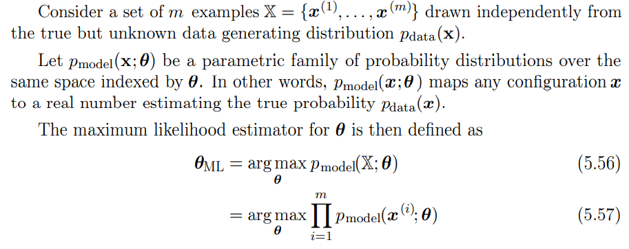
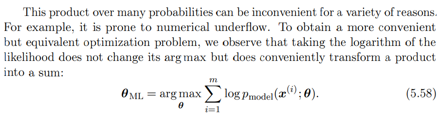
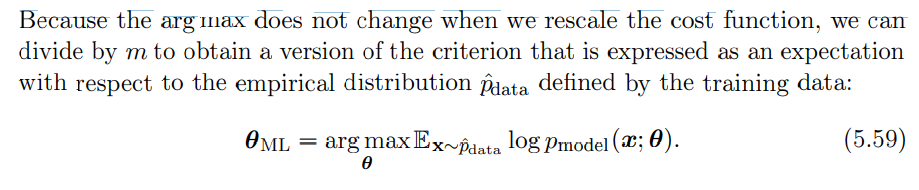
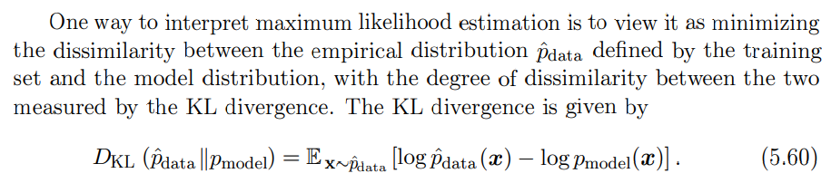
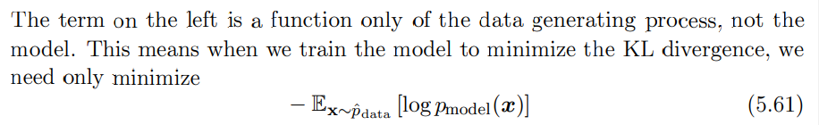

# 5.5 Maximum likelihood Estimation

이전에, 우리는 공통 추정기의 몇 가지 정의를 보고 그 속성을 분석하였다. 그런데 이 추정기들은 어디서 왔을까? 일부 함수가 좋은 추정기를 만들 수 있다고 추측하고 그 편향과 분산을 분석하는 대신, 우리는 다른 모델에 대한 좋은 추정기인 특정 함수를 도출할 수 있는 몇 가지 원칙을 가지고 싶다.

이러한 가장 일반적인 원칙은 최대우도원칙이다. 

pdata(x) 분포를 생성하는 실제 데이터와는 독립적으로 그려진 일련의 예시 X = {x1, ... , xm}을 생각해 보자.

pm모델(x;α)을 α에 의해 지수화된 동일한 공간에 대한 확률분포의 파라메트릭 계열로 하자. 즉, pmodel(x;α)은 모든 구성 x를 실제 확률 pdata(x)를 추정하는 실제 숫자에 매핑합니다.

그러면 α에 대한 최대우도 추정기는 다음과 같이 정의된다.

(5.56, 57)

이것은 여러 가지 이유로 인해 불편할 수 있다. 예를 드르어, 수치적 언더플로우가 발생하기 쉽다. 보다 편리하지만 동등한 최적화 문제를 얻기 위해, 우린느 우도의 로그를 취하면 argmax가 변경되지 않고 이것을 다음과 같은 합으로 편리하게 변환하는 것을 볼 수 있다.

(5.58)

비용 함수를 다시 조정할 때 argmax는 변경되지 않기 때문에, 우리는 훈련 데이터에 의해 정의된 경험적 분포 p² 데이터와 관련하여 기대치로 표현되는 기준의 버전을 얻기 위해 m으로 나눌 수 있다.

(5.59)

최대우도 추정을 해석하는 한 가지 방법은 훈련 세트에 의해 정의된 경험적 분포 p² 데이터와 모델 분포 간의 차이를 최소화하고 KL 발산에서 측정한 두 분포 간의 차이 정도를 갖는 것으로 보는 것이다. KL 차이는 에 의해 주어진다.

(5.60)

왼쪽의 항은 데이터 생성 프로세스의 함수일 뿐 모델이 아닙니다. 이는 KL 차이를 최소화하기 위해 모델을 훈련할 때, 우리는 최소화만 하면 된다는 것을 의미한다.

(5.61)

물론 방정식 5.59의 최대화와 같습니다.

이 KL 차이를 최소화하는 것은 분포 간의 교차 엔트로피를 최소화하는 것과 정확히 일치한다. 많은 저자들이 베르누이 또는 소프트맥스 분포의 음의 로그 우도를 식별하기 위해 "크로스 엔트로피"라는 용어를 사용하지만, 그것은 잘못된 명칭이다. 음의 로그 우도로 구성된 모든 손실은 훈련 세트에 의해 정의된 경험적 분포와 모델에 의해 정의된 확률 분포 사이의 교차 엔트로피이다. 예를 들어, 평균 제곱 오차는 경험적 분포와 가우스 모형 사이의 교차 엔트로피이다.

따라서 모델 분포를 경험적 분포 p² 데이터와 일치시키기 위한 시도로서 최대 가능성을 볼 수 있다. 이상적인 경우, 실제 데이터 생성 배포 데이터를 일치시키고 싶지만 이 배포에 직접 액세스할 수 없습니다.

최적 α는 가능성을 최대화하거나 KL 분산을 최소화하는 것과 관계없이 동일하지만, 목표 함수의 값은 다르다. 소프트웨어에서, 우리는 종종 비용 함수를 최소화한다고 표현한다.

따라서 최대 가능성은 음의 로그 우도(NLL)의 최소화 또는 이에 상응하는 교차 엔트로피의 최소화가 된다. 최소 KL 발산에서의 최대우도 관점은 KL 발산에서 알려진 최소값이 0이기 때문에 이 경우에 도움이 된다. x가 실제 값일 때 음의 로그 가능성은 실제로 음수가 될 수 있습니다.

# Reference
- [Maximum Likelihood Method](https://junha1125.tistory.com/24)
- [Maximum Likelihood Estimation](https://seungtae-jeff.tistory.com/entry/%ED%86%B5%EA%B3%84%ED%95%99-1-%EC%B5%9C%EB%8C%80%EC%9A%B0%EB%8F%84%EC%B6%94%EC%A0%95%EB%B2%95)
- [Maximum Likelihood Estimation 2 공돌이의 수학정리노트](https://angeloyeo.github.io/2020/07/17/MLE.html)
- [Maximum Likelihood Estimation 3 San-ho Lee](https://www.youtube.com/watch?v=sOtkPm_1GYw&ab_channel=SanghoLee)